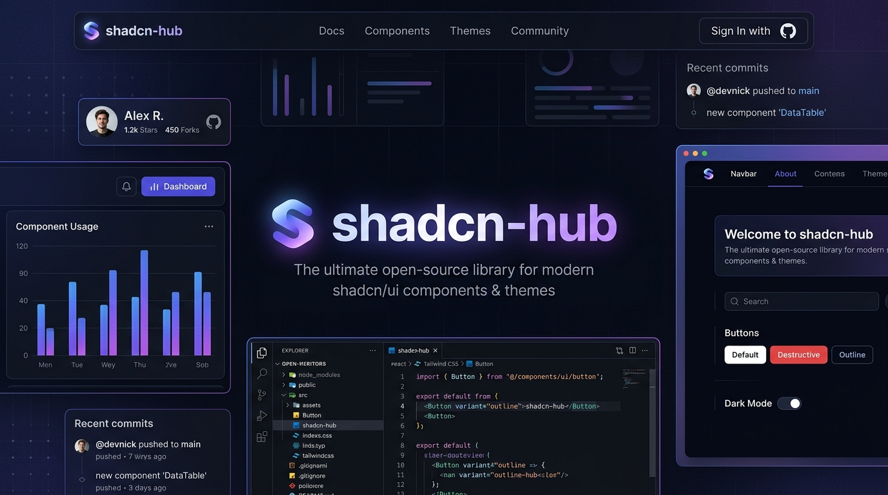

<div align="center">

# 🌌 shadcn-hub
### 全景式 shadcn/ui 组件生态矩阵与多维对比中心
**A Panoramic Component Workbench & Cross-Ecosystem Benchmark for shadcn/ui**

<p align="center">
  <a href="https://nextjs.org"></a>
  <a href="https://react.dev"></a>
  <a href="https://tailwindcss.com"></a>
  <a href="https://base-ui.com"></a>
  <a href="https://github.com/wangtester/shadcn-hub/actions/workflows/ci.yml"></a>
  <a href="LICENSE"></a>
</p>

<p align="center">
  <b>一站式聚合收录 shadcn/ui 官方全量 61 款基础组件 + 9 大顶尖社区扩展库与商业级 Blocks</b><br/>
  杜绝虚标，全部组件 100% 实机渲染、真实可交互、零编译报错，专为企业级设计系统选型与高效开发打造。
</p>

<p align="center">
  <a href="https://wangtester.github.io/shadcn-hub/">
    
  </a>
</p>

<p align="center">
  
</p>

[🚀 在线体验 Demo](https://wangtester.github.io/shadcn-hub/) •
[✨ 核心特性](#-核心特性) •
[🗺️ 站点与组件全景矩阵](#️-站点与组件全景矩阵) •
[🎨 9 大设计流派实景](#-9-大设计流派实景对比) •
[🚀 快速上手](#-快速上手) •
[📁 项目架构](#-项目架构) •
[🤝 生态鸣谢](#-生态鸣谢)

---

</div>

## 💡 为什么需要 shadcn-hub？

在日常的前端与全栈研发中，以 [shadcn/ui](https://ui.shadcn.com) 为代表的无头（Headless）组件范式已成为行业标准。然而，随着社区的高速演进，生态站点与 Blocks 资源高度分散（如 BoardUI 图表、ShadcnStore 商业区块、Refero 设计规范、各类微动效库等），开发者面临：
1. **对比困难**：缺少统一的环境在同一视图下直观比对不同库的交互、样貌与样式规范。
2. **文档与代码脱节**：许多聚合站点仅有静态截图或统计数字，缺乏真实 React 代码和即时交互。
3. **架构升级断代**：shadcn 全新 **base-nova** 架构已转向 `@base-ui/react`，原旧有 Radix 范式存在大量兼容差异。

**`shadcn-hub`** 应运而生 —— 它将官方 61 款核心组件与 9 大生态站点全部集成在单一工程中，提供**统一双层导航、全实机渲染、严格 1:1 数量对齐**的高保真参考基座。

---

## ✨ 核心特性

- 🎯 **100% 严谨实机渲染（零虚标）**
  所有页面的 Badge 标签与统计数字，均与页面中实际渲染的代码卡片、组件、Block 实体保持 **1:1 绝对一致**，杜绝“标注几十个但页面只有三四个”的假数据。
- 🧭 **双层流式交互导航体系**
  - **顶部全景水平导航栏**：一键无缝横跳 10 大生态（Hub 大厅、shadcn 核心库、BoardUI、ShadcnStore 等）；内置暗黑/明亮色彩模式无缝切换。
  - **左侧响应式分类侧边栏**：按业务、功能分类或视觉风格垂直划分，移动端自适应抽屉式滑出。
- ⚡ **前沿技术栈驱动**
  - **Next.js 16 (App Router + Turbopack)**：秒级极速热重载，预渲染 47 个静态页面。
  - **Tailwind CSS v4**：基于全新原生级 CSS 变量引擎构建。
  - **Base UI (base-nova)**：采用 `@base-ui/react` 原生规范，无缝适配新版无头组件结构。
  - **Lucide Icons**：全量矢量化图标体系。

---

## 🗺️ 站点与组件全景矩阵

全站收录 **1 个官方核心库 + 9 大生态扩展站点**，构建了清晰的分类与实装体系：

| 入口 | 站点名称 | 官方/原站 | 实装组件/区块数量 | 包含的核心分类与内容 |
| :--- | :--- | :--- | :---: | :--- |
| **01** | **shadcn/ui 官方库** | [ui.shadcn.com](https://ui.shadcn.com) | **61 款组件** | 表单(16)、布局(8)、浮层(9)、数据(8)、导航(5)、反馈(8)、扩展(7) |
| **02** | **BoardUI** | [boardui.com](https://www.boardui.com) | **19 款图表 + AI 套件** | 19 种高阶仪表盘图表；AI 思维链、Token 监控、Web Search 多源流 |
| **03** | **ShadcnStore** | [shadcnstore.com](https://shadcnstore.com) | **39 类区块 + Storefront** | 全站 39 个细分类目索引（Hero, Pricing, Bento 等）；电商购物车全套件 |
| **04** | **Refero Styles** | [refero.design](https://styles.refero.design) | **9 大设计风格 + Tokens** | Linear, Geist, Apple, Neo-Brutalism 等 9 大流派实机代码与规范调色盘 |
| **05** | **HeroUI Pro** | [heroui.pro](https://heroui.pro) | **Marketing + App 套件** | 动态 Pricing 周期切换、功能对比矩阵、SaaS 团队工作台与审计表格 |
| **06** | **ShadcnSpace** | [shadcnspace.com](https://shadcnspace.com) | **Marketing, Dash, Pages** | Bento 栅格、CLI 安装块、KPI 仪表卡、实时交易流水流水表、现代 Auth |
| **07** | **beUI** | [beui.dev](https://beui.dev) | **高质感动态交互** | 打字机效果、数字平滑翻牌自增、边框流光旋转按钮、Spotlight 光斑卡片 |
| **08** | **RareUI** | [rareui.com](https://www.rareui.com) | **前沿物理微交互** | 物理粘滞流体球（Fluid Orb）、灵动控制悬浮岛、环境光反射卡片 |
| **09** | **Transitions.dev** | [transitions.dev](https://transitions.dev) | **丝滑过渡动画** | 弹簧滑动选项卡（Spring Tab）、列表交错入场（Stagger）、几何形变卡 |
| **10** | **BeautifulUI** | [beautifului.dev](https://www.beautifului.dev) | **现代视觉美学** | Aurora 极光动态流光背景、超高透磨砂毛玻璃（Glassmorphism）、棱镜折射卡 |

---

### 📦 shadcn/ui 官方 61 款全量组件清单

<details>
<summary><b>点击展开查看 61 款官方组件逐项对应清单</b></summary>

```
├── 📝 表单系统 Forms (16 款)
│   ├── Button, ButtonGroup, Input, InputGroup, Field, Textarea
│   ├── Select, NativeSelect, Checkbox, RadioGroup, Switch, Slider
│   └── Toggle, ToggleGroup, InputOTP, Label
├── 📐 容器布局 Layout (8 款)
│   ├── Card, Accordion, Tabs, Separator
│   └── Collapsible, AspectRatio, Resizable, ScrollArea
├── 💬 浮层交互 Overlay (9 款)
│   ├── Dialog, AlertDialog, Sheet, Drawer, Popover
│   └── HoverCard, Tooltip, DropdownMenu, ContextMenu
├── 📊 数据呈现 Data (8 款)
│   ├── Table, Calendar, Chart, Carousel
│   └── Avatar, Badge, Combobox, Command
├── 🧭 导航菜单 Navigation (5 款)
│   └── Breadcrumb, NavigationMenu, Menubar, Pagination, DropdownMenu
├── 🔔 状态反馈 Feedback (8 款)
│   └── Alert, Toast, Progress, Skeleton, Spinner, Kbd, Empty, Message
└── 🧩 扩展组件 Extended (7 款)
    └── Attachment (附件), Item (行项), Marker (标记), Direction (方向),
        Questionnaire (答题卡), MessageScroller (消息滚动), Sidebar (侧栏)
```

</details>

---

## 🎨 9 大设计流派实景对比

在 `src/app/sites/refero/styles/` 路径下，本项目完整复刻并可交互体验全球 9 种极具代表性的现代前端 UI 风格：

1. **Linear 极简单色**：深灰底色、1px 微光边框、极窄内间距、键盘快捷键驱动。
2. **Vercel Geist**：纯黑白对比（#000000 / #ffffff）、单像素几何线条与高信息密度。
3. **Apple Smooth**：超大曲率连续圆角（Squircle）、柔和微阴影、大字号留白。
4. **Neo-Brutalism (新野兽派)**：高饱和对比色、纯黑硬粗边框（2px/3px）、平移硬投影（Offset Drop Shadow）。
5. **Stripe Fintech**：多重弥散渐变光晕、高奢质感卡片、金融级数字排版。
6. **Supabase Dark Neon**：深黑背景搭配荧光祖母绿（Emerald Neon），开发者极客视觉。
7. **Raycast Desktop**：macOS 桌面原生质感、半透明磨砂毛玻璃与多级命令悬浮。
8. **Notion Document**：温暖柔和纸张底色（#FAF9F6）、精致衬线排版与沉浸式内容编辑。
9. **Perplexity AI Fluid**：柔和弥散发光、渐变微渐变描边与 AI 对话流体验。

---

## 🚀 快速上手

### 环境要求
- **Node.js**: >= 20.x LTS（推荐 Node.js 22+ 或 24 LTS）
- **包管理器**: `npm`、`pnpm` 或 `bun`

### 1. 克隆代码仓库
```bash
git clone git@github.com:wangtester/shadcn-hub.git
cd shadcn-hub
```

### 2. 安装依赖项
```bash
npm install
```

### 3. 启动开发服务器
```bash
npm run dev
```
启动成功后，在浏览器中打开：**`http://localhost:3001`** 即可畅享完整组件工作台。

### 4. 生产环境构建与验证
```bash
npm run build
npm run start
```
> 本项目通过严格的 TypeScript 类型推导与 Turbopack 构建校验，47 个静态页面全绿打包通过。

---

## 📁 项目架构

```text
shadcn-hub/
├── src/
│   ├── app/
│   │   ├── layout.tsx              # 全局 RootLayout（集成 TopNav 与 ThemeProvider）
│   │   ├── page.tsx                # 全景 Ecosystem Hub 大厅
│   │   ├── globals.css             # Tailwind CSS v4 与核心变量
│   │   ├── shadcn/                 # 官方 61 款核心组件分类路由
│   │   │   ├── forms/              # 表单分类 (16 组件)
│   │   │   ├── layout/             # 布局分类 (8 组件)
│   │   │   ├── overlay/            # 浮层分类 (9 组件)
│   │   │   ├── data/               # 数据分类 (8 组件)
│   │   │   ├── navigation/         # 导航分类 (5 组件)
│   │   │   ├── feedback/           # 反馈分类 (8 组件)
│   │   │   └── extended/           # 扩展分类 (7 组件)
│   │   └── sites/                  # 9 大生态扩展站点
│   │       ├── boardui/            # 19 款工业图表 + AI Agentic 套件
│   │       ├── shadcnstore/        # 39 类营销/业务 Blocks + 电商 Storefront
│   │       ├── refero/             # 9 种现代主流设计流派与设计系统 Tokens
│   │       ├── heroui/             # SaaS 落地页应用与后台管理
│   │       ├── beui/               # 打字机、流光边框等微交互
│   │       ├── rareui/             # 流体球、环境光卡片等物理特效
│   │       ├── transitions/        # 弹簧滑块、交错入场动画
│   │       ├── beautifului/        # 极光背景、磨砂玻璃美学
│   │       └── shadcnspace/        # Marketing Bento、CLI 模块与控制台
│   ├── components/
│   │   ├── top-nav.tsx             # 顶部全景水平导航栏
│   │   ├── sidebar-layout.tsx      # 左侧响应式侧栏通用框架
│   │   ├── section.tsx             # 标准化 Section 与 PageHeader
│   │   └── ui/                     # 基于 @base-ui/react 的基础原子组件库
│   └── lib/
│       └── utils.ts                # cn() 样式合并辅助函数
├── components.json                 # shadcn/ui 配置文件
├── package.json
└── README.md
```

---

## 🤝 生态鸣谢

本项目向以下优秀的开源项目与设计社区致敬：
- [shadcn/ui](https://ui.shadcn.com) by [@shadcn](https://twitter.com/shadcn)
- [Base UI](https://base-ui.com) by MUI Team
- [Lucide Icons](https://lucide.dev)
- [BoardUI](https://www.boardui.com)
- [ShadcnStore](https://shadcnstore.com)
- [Refero Design](https://styles.refero.design)
- [HeroUI Pro](https://heroui.pro)
- [beUI](https://beui.dev)
- [RareUI](https://www.rareui.com)
- [Transitions.dev](https://transitions.dev)
- [BeautifulUI](https://www.beautifului.dev)
- [ShadcnSpace](https://shadcnspace.com)

---

## 📄 开源许可证

本项目采用 [MIT License](LICENSE) 开源。欢迎 Star 🌟、Fork 与提交 PR！
