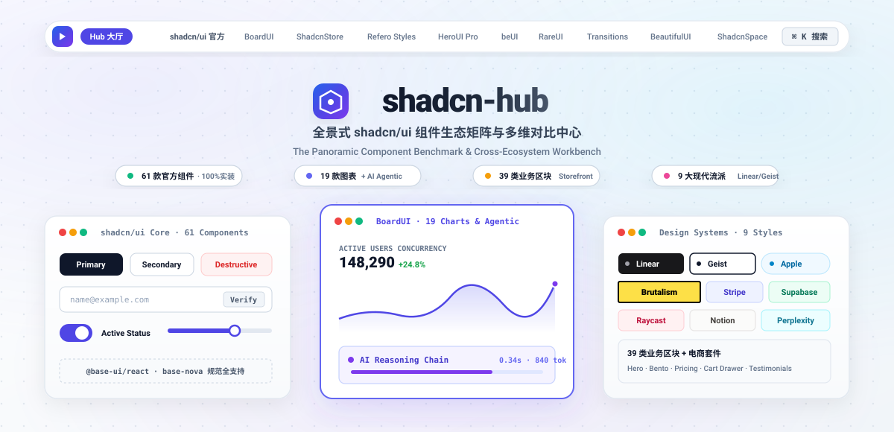

<div align="center">

# 🌌 shadcn-hub
### shadcn 生态组件与区块画廊
**A Panoramic Component Workbench & Cross-Ecosystem Benchmark for shadcn/ui**

<p align="center">
  <a href="README.md">English</a> | <b>简体中文</b>
</p>

<p align="center">
  <a href="https://nextjs.org"></a>
  <a href="https://react.dev"></a>
  <a href="https://tailwindcss.com"></a>
  <a href="https://base-ui.com"></a>
  <a href="https://github.com/wangtester/shadcn-hub/actions/workflows/ci.yml"></a>
  <a href="LICENSE"></a>
  <a href="https://wangtester.github.io/shadcn-hub/"></a>
</p>

<p align="center">
  <b>一站式聚合收录 shadcn/ui 官方全量 64 款基础组件 + 11 大顶尖社区扩展库与 24+ 款前端设计师常备工具箱</b><br/>
  杜绝虚标，全部组件 100% 实机渲染、真实可交互、零编译报错，专为企业级设计系统选型与高效开发打造。
</p>

<!-- 12 大生态直达标牌与 SEO 关键词直显 -->
<p align="center">
  <b>📦 全量实装收录生态索引：</b><br/>
  <a href="#1-shadcnui-官方核心库全量-64-款组件"><code>shadcn/ui 官方核心 (64)</code></a> •
  <a href="#2-生态与垂直扩展站点"><code>Magic UI (动效 &amp; Bento)</code></a> •
  <a href="#2-生态与垂直扩展站点"><code>Aceternity UI (极客光锥 &amp; 3D)</code></a> •
  <a href="#3-前端设计师常备工具箱-24-款专业神器"><code>🛠️ 设计师百宝箱 (24+)</code></a><br/>
  <a href="#2-生态与垂直扩展站点"><code>BoardUI (19 图表 &amp; AI)</code></a> •
  <a href="#2-生态与垂直扩展站点"><code>ShadcnStore (39 区块)</code></a> •
  <a href="#2-生态与垂直扩展站点"><code>Refero Styles (9 流派)</code></a> •
  <a href="#2-生态与垂直扩展站点"><code>HeroUI Pro</code></a><br/>
  <a href="#2-生态与垂直扩展站点"><code>beUI 动效</code></a> •
  <a href="#2-生态与垂直扩展站点"><code>RareUI 物理交互</code></a> •
  <a href="#2-生态与垂直扩展站点"><code>Transitions.dev</code></a> •
  <a href="#2-生态与垂直扩展站点"><code>BeautifulUI 美学</code></a> •
  <a href="#2-生态与垂直扩展站点"><code>ShadcnSpace 控制台</code></a>
</p>

<p align="center">
  <a href="https://wangtester.github.io/shadcn-hub/">
    
  </a>
</p>

<!-- 亮暗自适应矢量架构横幅 -->
<p align="center">
  <a href="https://wangtester.github.io/shadcn-hub/">
    <picture>
      <source media="(prefers-color-scheme: dark)" srcset="public/banner-dark.svg">
      <source media="(prefers-color-scheme: light)" srcset="public/banner-light.svg">
      
    </picture>
  </a>
</p>

[🚀 在线体验 Demo](https://wangtester.github.io/shadcn-hub/) •
[✨ 核心特性](#-核心特性) •
[🗺️ 站点与组件全景矩阵](#️-站点与组件全景矩阵) •
[🛠️ 设计师常备百宝箱](#️-前端设计师常备工具箱-24-款专业神器) •
[🎨 9 大设计流派实景](#-9-大设计流派实景对比) •
[🚀 快速上手](#-快速上手) •
[📁 项目架构](#-项目架构) •
[🤝 生态鸣谢](#-生态鸣谢)

---

</div>

## 💡 为什么需要 shadcn-hub？

在日常的前端与全栈研发中，以 [shadcn/ui](https://ui.shadcn.com) 为代表的无头组件已成为现代 React/Next.js 生态的事实标准。然而，随着社区衍生项目的爆发式增长，大量优秀的组件库与 Blocks 呈现**严重碎片化**分布：
- 想要专业动效与高转化 Landing Page 便当盒？需要前往 **[Magic UI](https://magicui.design)**；
- 想要极具辨识度的暗黑极客美学、聚光神灯效应与 3D 图钉？需要探索 **[Aceternity UI](https://ui.aceternity.com)**；
- 想要专业仪表盘图表与 AI 智能体流水？需要单独翻阅 **[BoardUI](https://www.boardui.com)**；
- 想要商业级落地页与电商区块？需要单独翻阅 **[ShadcnStore](https://shadcnstore.com)**；
- 想要探索 Linear、Geist、Stripe 等现代主流设计风格规范？需要查阅 **[Refero Design](https://styles.refero.design)**；
- 想要 SaaS 团队后台应用界面？需要查找 **[HeroUI Pro](https://heroui.pro)**；
- 想要极致打字机、流光边框、物理流体等微动效？又需要分别引入 **[beUI](https://beui.dev)**、**[RareUI](https://www.rareui.com)**、**[Transitions.dev](https://transitions.dev)** 或 **[BeautifulUI](https://www.beautifului.dev)**；
- 此外，专业设计师在找调色板、真实产品走查、平滑非线性阴影和色盲无障碍审计时，常年在几十个外部小工具间艰难切换。

不仅在十几个独立网站间来回跳转极其繁琐，许多展示站还存在“标注几十个但页面只有三四个占位图”的虚标问题。更关键的是，shadcn 最新 **base-nova** 架构已经转向 `@base-ui/react`，原旧有 Radix 范式存在大量兼容差异。

**`shadcn-hub`** 彻底解决了这一切 —— 它将 **shadcn/ui 官方全量 64 款组件**、**11 大衍生生态** 以及 **24+ 款专业前端设计师百宝箱** 统一收录并全部实机运行在一个项目中，提供**双层全景导航、全局 Cmd+K 搜索、全实装真实代码、严格 1:1 数量对齐**的一站式画廊。

> 🌐 **English Overview**: *shadcn-hub is an all-in-one panoramic workbench and cross-ecosystem benchmark for shadcn/ui. It collects the official 64 core components alongside 11 curated derivative libraries (Magic UI, Aceternity UI, BoardUI, ShadcnStore, Refero Styles, HeroUI Pro, beUI, RareUI, Transitions.dev, BeautifulUI, ShadcnSpace) and a curated Designer Toolbox with 100% interactive running code, dual navigation, and global Cmd+K search built on Next.js 16, Tailwind CSS v4, and @base-ui/react.*

---

## ✨ 核心特性

- 🎯 **100% 严谨实机渲染（零虚标）**
  所有页面的 Badge 标签与统计数字，均与页面中实际渲染的代码卡片、组件、Block 实体保持 **1:1 绝对一致**，杜绝“标注几十个但页面只有三四个”的假数据。
- 🛠️ **专属前端设计师常备工具箱 (`/tools`)**
  收录实景测色、真实产品交互走查、苹果风网格弥散、非线性多层阴影、CSS 弹性曲线与 WCAG 色盲视力模拟等 24+ 款专业神器，支持一键直达与链接复制。
- 🧭 **双层流式交互导航体系**
  - **顶部全景水平导航栏**：一键无缝横跳 12 大生态与百宝箱；内置暗黑/明亮色彩模式无缝切换。
  - **左侧响应式分类侧边栏**：按业务、功能分类或视觉风格垂直划分，移动端自适应抽屉式滑出。
- 🔍 **全局全局命令面板 (`⌘ + K` / `Ctrl + K`)**
  模糊检索全站 64 款组件、19 种图表、39 类业务区块、9 大设计流派与外部设计神器，键盘快速直达。
- ⚡ **前沿技术栈驱动**
  - **Next.js 16 (App Router + Turbopack)**：秒级极速热重载，预渲染 58 个静态页面。
  - **Tailwind CSS v4**：基于全新原生级 CSS 变量引擎构建。
  - **Base UI (base-nova)**：采用 `@base-ui/react` 原生规范，无缝适配新版无头组件结构。
  - **Lucide Icons**：全量矢量化图标体系。

---

## 🗺️ 站点与组件全景矩阵

| # | 生态库 / 站点名称 | 原始网址 | 实装收录数量 | 核心功能与收录范围 |
| :-: | :--- | :--- | :-: | :--- |
| **01** | **shadcn/ui 官方核心** | [ui.shadcn.com](https://ui.shadcn.com) | **64 款全量组件** | 表单类 (17), 布局类 (8), 浮层类 (8), 数据展示 (9), 导航类 (5), 反馈类 (8), 扩展类 (9) |
| **02** | **Magic UI** | [magicui.design](https://magicui.design) | **76 款组件 + 1 个区块** | 官方文档索引上的全部组件：Marquee 跑马灯、Dock 交互坞、Bento Grid 便当盒、Animated Beam 节点数据流、Border Beam 流光边框、Shine Border 高光边、Particles 粒子、Number Ticker 数字滚动、Meteors 流星、Retro Grid 复古网格、Globe 点阵地球、Icon Cloud 图标云、Terminal 终端、Tweet Card 推文卡等，每款都有独立原地实机预览 |
| **03** | **Aceternity UI** | [ui.aceternity.com](https://ui.aceternity.com) | **4 视觉 + 2 区块** | Lamp Header 神灯光锥聚光, Sparkles 星光粒子, 3D Pin 空间图钉, 渐变边框; Tracing Beam 阅读追踪流, Background Beams |
| **04** | **BoardUI** | [boardui.com](https://www.boardui.com) | **19 图表 + AI 交互 + 基元** | 19 款高密度工业图表卡片; AI 思维链、Token 监控网格; Announcement Banner 通告条、Filter Chips 过滤芯片、Delta KPI |
| **05** | **ShadcnStore** | [shadcnstore.com](https://shadcnstore.com) | **39 类目区块 + 商城** | 覆盖全部 39 个垂直业务区块（Hero, Bento, Pricing 定价表, Stats 指标墙, CTA 横幅）；完整购物车侧抽屉 |
| **06** | **Refero Styles** | [refero.design](https://styles.refero.design) | **9 流派 + Tokens** | Linear, Geist, Apple, Neo-Brutalism, Stripe, Supabase... 等实景对比；AI-readable DESIGN.md 规范即时导出 |
| **07** | **HeroUI Pro** | [heroui.pro](https://heroui.pro) | **营销与团队后台套件** | 年付/月付切换定价卡片、特性对比表、SaaS 团队工作空间管理与配置表 |
| **08** | **ShadcnSpace** | [shadcnspace.com](https://shadcnspace.com) | **营销首屏、控制台、页面** | 非对称 Bento 栅格、CLI 安装代码块、KPI 复合走势、现代业务登录页 |
| **09** | **beUI** | [beui.dev](https://beui.dev) | **动态特效与微交互** | 打字机文本流、平滑里程表翻牌、流光边框按钮、Spotlight 卡片、拖拽上传容器、磁吸分段菜单 |
| **10** | **RareUI** | [rareui.com](https://www.rareui.com) | **物理质感与罕见交互** | Fluid Orb 蠕动流体光晕球、悬浮灵动控制岛、展开式文件夹、微动摇摆铃铛、浮动表情反应槽 |
| **11** | **Transitions.dev** | [transitions.dev](https://transitions.dev) | **平滑视图过渡** | Spring 弹簧滑块、交错列表级联入场、Text Swap 垂直轮转置换、Status Badge 胶囊流体形变 |
| **12** | **BeautifulUI** | [beautifului.dev](https://www.beautifului.dev) | **现代高颜值美学** | Aurora 极光流光卡、多层磨砂玻璃拟态、HITL 智能体审批卡、Tool Chips 工具芯片、Context Chunks |
| **13** | **前端设计师百宝箱** | [`/tools`](file:///D:/code/shadcn-demo/src/app/tools) | **24+ 款常备工具** | 色彩系统、设计灵感、图标字体、渐变背景、阴影拟态、动效物理、WCAG 对比度色盲无障碍审计 |

---

## 🛠️ 前端设计师常备工具箱 (24+ 款专业神器)

访问路径：[`/tools`](file:///D:/code/shadcn-demo/src/app/tools)，专为设计工程师与 UI/UX 设计师整理的高效日常百宝箱：

1. **色彩系统 (Color & Palettes)**: Coolors (空格极速调色), Realtime Colors (整页真实 UI 映射测色), UI Colors (Tailwind 50-950 色阶), Happy Hues (色彩心理学语境), Colormind (神经网络 AI 配色)。
2. **设计灵感与走查 (Inspiration)**: Mobbin (300,000+ 顶尖真实 App 业务流拆解), Godly (天花板级 Web 视觉画廊), Land-book (SaaS 着陆页精选长截图), Refero Design (22,000+ 真实 Web UI 索引), Awwwards (国际设计大奖)。
3. **图标与字体 (Assets)**: Lucide Icons (shadcn 标配单线矢量), Fontshare (超高品质免费商用西文/可变字体), SVGL (现代科技品牌高清矢量), Tabler Icons (5,000+ 开源图标)。
4. **渐变与纹理 (Background)**: CSS Gradient (多断点渐变拖拽), Mesh Gradient (苹果风流体网格弥散), Haikei (波浪/低多边形/光斑发生器), Hero Patterns (纯 CSS 平铺图案)。
5. **阴影与拟态 (Shadows & Glass)**: SmoothShadow (Brumm 非线性多层自然漫反射阴影), Glassmorphism Generator (毛玻璃高光微调), Neumorphism.io (双向凹凸软拟物)。
6. **动效与物理 (Motion & Physics)**: Cubic-Bezier.com (Lea Verou 弹性曲线实验室), Animista (纯 CSS 关键帧合集), LottieFiles (高性能矢量动效)。
7. **无障碍与规范 (Design Tokens & A11y)**: WhoCanUse (色弱色盲视力真实模拟测算), WebAIM Contrast Checker (WCAG AA/AAA 权威检测), Open Props (跨框架 Design Tokens)。

---

### 📦 官方全量组件实装清单 (64/64)

<details>
<summary><b>点击展开 64 款组件详细分类</b></summary>

```
├── 📝 表单类 (Forms) - 17 款
│   ├── Button 按钮, ButtonGroup 按钮组, Input 输入框, InputGroup 输入框组
│   ├── Field 表单域, Textarea 文本域, Select 下拉选择器, NativeSelect 原生选择
│   ├── Checkbox 复选框, RadioGroup 单选组, Switch 开关, Slider 滑块
│   └── Toggle 切换键, ToggleGroup 切换组, InputOTP 验证码, Label 标签, DatePicker 日期选择
├── 📐 布局类 (Layout) - 8 款
│   ├── Card 卡片容器, Accordion 手风琴折叠, Tabs 标签页, Separator 分割线
│   └── Collapsible 折叠面板, AspectRatio 宽高比, Resizable 可调分栏, ScrollArea 滚动区
├── 💬 浮层类 (Overlay) - 8 款
│   ├── Dialog 模态对话框, AlertDialog 警示对话框, Sheet 侧边抽屉, Drawer 下拉抽屉
│   └── Popover 气泡卡片, HoverCard 悬停卡, Tooltip 文字提示, ContextMenu 右键菜单
├── 📊 数据展示 (Data Display) - 9 款
│   ├── Table 基础表格, DataTable 现代化高阶数据表格 (搜索/排序/分页/多选)
│   ├── Calendar 日历面板, Chart 现代化图表 (Recharts 集成), Carousel 走马灯轮播
│   └── Avatar 头像, Badge 徽章, Combobox 组合输入下拉框, Command 命令面板
├── 🧭 导航类 (Navigation) - 5 款
│   └── Breadcrumb 面包屑, NavigationMenu 导航菜单, Menubar 菜单栏, Pagination 分页器, DropdownMenu 下拉菜单
├── 🔔 反馈类 (Feedback) - 8 款
│   └── Alert 警告提示, Toast 吐司全局通知, Progress 进度条, Skeleton 骨架屏, Spinner 加载动画, Kbd 键盘快捷键, Empty 空状态, Message 消息横条
└── 🧩 扩展与排版 (Extended & Typography) - 9 款
    ├── Attachment 附件卡, Item 列表行, Marker 步骤标记, Direction 环绕方向
    ├── Questionnaire 问卷卡, MessageScroller 消息滚动器, Sidebar 垂直应用侧边栏
    └── Bubble 智能对话气泡与反馈槽, Typography 官方规范排版 (Heading, Prose, Blockquote)
```

</details>

---

## 🎨 9 大设计流派实景对比

位于 `src/app/sites/refero/styles/`，同屏对比全球 9 种主流前端视觉流派：

1. **Linear 灰阶极简**：深灰中性底色、1px 微弱精致边框、高紧凑快捷键驱动。
2. **Vercel Geist 黑白纯粹**：极致黑白对比（`#000000` / `#ffffff`）、极简等宽字符几何线条。
3. **Apple Smooth 大曲率柔光**：苹果式超椭圆（Squircle）饱满大圆角、弥散型多层柔和投影。
4. **Neo-Brutalism 新野兽派**：高饱和反差撞色、2px/3px 纯黑硬轮廓粗边框、无模糊硬阴影。
5. **Stripe Fintech 金融高奢**：多断点流体渐变光晕、微质感立体悬浮卡、严谨数字排版。
6. **Supabase Dark Neon 霓虹极客**：深炭黑底色搭配高亮翡翠绿（`#10b981`），浓郁黑客终端质感。
7. **Raycast Desktop 桌面原生**：拟真 macOS 原生桌面质感、多层悬浮命令栏。
8. **Notion Document 纸质排版**：暖调纸质米白底色（`#FAF9F6`）、衬线与无衬线兼具的沉浸阅读排版。
9. **Perplexity AI Fluid 柔光流体**：径向柔和微弥散光晕、智能交互问答流。

---

## 🚀 快速上手

### 环境要求
- **Node.js**: `>= 20.x LTS` (推荐 Node.js 22+ 或 24 LTS)
- **包管理器**: `npm`、`pnpm` 或 `bun`

### 1. 克隆代码仓库
```bash
git clone git@github.com:wangtester/shadcn-hub.git
cd shadcn-hub
```

### 2. 安装项目依赖
```bash
npm install
```

### 3. 启动本地开发服务
```bash
npm run dev
```
启动成功后，浏览器访问 **`http://localhost:3001`** 即可畅享完整交互画廊。

### 4. 生产环境构建校验
```bash
npm run build
npm run start
```
> 全站 58 个静态路由均支持 Next.js Turbopack 编译，零警告，零类型报错。

---

## 📁 项目架构

```text
shadcn-hub/
├── src/
│   ├── app/
│   │   ├── layout.tsx              # 全局根布局 (含 TopNav、Footer 与 metadataBase)
│   │   ├── page.tsx                # 生态全景大厅 (聚合 12 大生态与百宝箱横幅)
│   │   ├── tools/                  # 🛠️ 前端设计师常备工具箱 (24+ 款专业神器)
│   │   ├── globals.css             # Tailwind CSS v4 变量与动画关键帧
│   │   ├── shadcn/                 # 64 款官方核心组件实装
│   │   │   ├── forms/              # 表单类 (17 款，含 DatePicker)
│   │   │   ├── layout/             # 布局类 (8 款)
│   │   │   ├── overlay/            # 浮层类 (8 款)
│   │   │   ├── data/               # 数据展示类 (9 款，含 DataTable)
│   │   │   ├── navigation/         # 导航类 (5 款)
│   │   │   ├── feedback/           # 反馈类 (8 款)
│   │   │   └── extended/           # 扩展与排版类 (9 款，含 Bubble 与 Typography)
│   │   └── sites/                  # 11 大社区衍生扩展生态
│   │       ├── magicui/            # Magic UI 动效组件与 Bento 区块
│   │       ├── aceternity/         # Aceternity Lamp 聚光、3D Pin 与追踪流
│   │       ├── boardui/            # 19 款工业图表 + AI 交互 + 核心看板基元
│   │       ├── shadcnstore/        # 39 个细分类目业务区块 (Bento, 定价表, 指标墙, CTA)
│   │       ├── refero/             # 9 大现代设计流派实景与 DESIGN.md 规范导出
│   │       ├── heroui/             # SaaS 定价周期切换与工作区管理应用
│   │       ├── beui/               # 打字机、Spotlight 光斑、拖拽上传、磁吸菜单
│   │       ├── rareui/             # Fluid Orb 流体球、灵动岛、可展开文件夹、摇摆铃铛
│   │       ├── transitions/        # Spring 弹簧滑块、文本垂直置换、胶囊徽章形变
│   │       ├── beautifului/        # 极光背景、HITL 人机协同审批卡、工具状态芯片
│   │       └── shadcnspace/        # Bento 栅格、CLI 代码块、现代鉴权页
│   ├── components/
│   │   ├── top-nav.tsx             # 顶部吸顶全景水平导航栏与百宝箱入口
│   │   ├── global-search.tsx       # 全局 Cmd + K 模糊检索面板
│   │   ├── sidebar-layout.tsx      # 响应式抽屉侧边栏分类布局
│   │   ├── site-footer.tsx         # 全站页脚与实时访客统计计数器
│   │   ├── section.tsx             # 标准化 Section 与 PageHeader
│   │   └── ui/                     # 基于 Base UI / Radix 的原子组件
│   └── lib/
│       └── utils.ts                # cn() 样式工具函数
├── components.json                 # shadcn/ui 项目配置
├── package.json
└── README.md
```

---

## 🤝 生态鸣谢

本工作台深深得益于以下优秀的开源项目与设计社区贡献：
- [shadcn/ui](https://ui.shadcn.com) by [@shadcn](https://twitter.com/shadcn)
- [Magic UI](https://magicui.design) by [@dillionverma](https://twitter.com/dillionverma)
- [Aceternity UI](https://ui.aceternity.com) by [@mannupaaji](https://twitter.com/mannupaaji)
- [Base UI](https://base-ui.com) by MUI Team
- [Lucide Icons](https://lucide.dev)
- [BoardUI](https://www.boardui.com)
- [ShadcnStore](https://shadcnstore.com)
- [Refero Design](https://styles.refero.design)
- [HeroUI Pro](https://heroui.pro)
- [beUI](https://beui.dev)
- [RareUI](https://www.rareui.com)
- [Transitions.dev](https://transitions.dev)
- [BeautifulUI](https://www.beautifului.dev)
- [ShadcnSpace](https://shadcnspace.com)

---

## 📄 开源许可证

本项目基于 [MIT License](LICENSE) 开源。欢迎点亮 Star 🌟、提交 Issue 与参与贡献！
