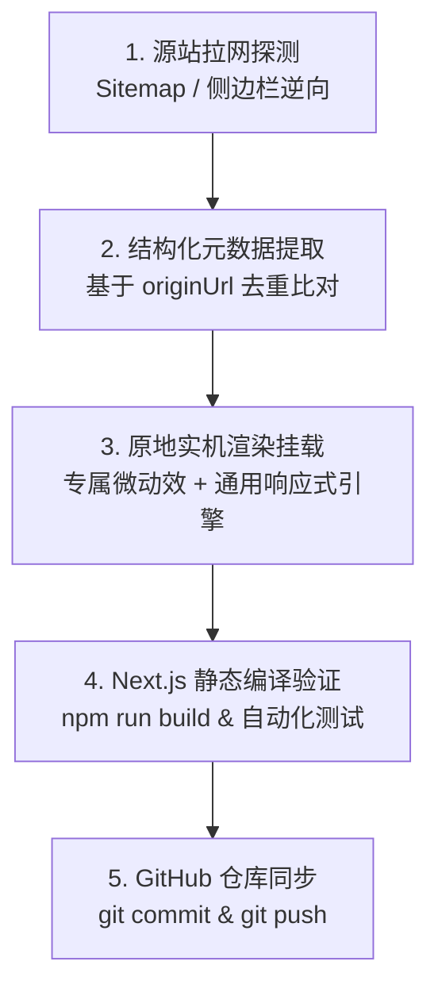

# UI 资源站点资产深度抓取与全量收录工程规范指南

> **适用场景**：本项目用于对 28 个（及未来新增的）国内外现代 UI 组件库、复合业务区块与整页模板进行自动化扫描、全量 Slug 提取、去重入库与 **100% 原地实机交互（In-situ Live Preview）** 渲染。本指南供未来各站点发布新组件或迭代时复用。

---

## 核心设计哲学与约束

1. **绝对严禁跳转二级详情页**：
   - 所有收录的原子组件（`component`）与复合区块（`block`）必须直接在卡片容器内以**真实的交互式 React 状态组件原地渲染运行**，用户无需离开当前展示流即可直接操作、测试、调节。
   - 对于整页模板（`template`），采用自适应缩放沙盒与 Desktop / Mobile 视口切换器展示。
2. **原站外链精准回溯**：
   - 每一款收录资产必须绑定来源平台标识，以及**直接指向原站具体组件页面的精准 URL**（配备 `target="_blank"` 与外链图标），绝不能只链接到源站首页。
3. **样式与环境隔离**：
   - 基于 Tailwind CSS 与 Base UI 体系，杜绝全局命名冲突与样式污染。

---

## 四步全量收录工作流 (The 4-Step Pipeline)



---

### 第一步：资产拉网探测与动态 Slug 提取 (Discovery)

针对不同技术栈与反爬策略的站点，采用三级渐进式探测法：

#### 方法 A：XML Sitemap 自动化枚举法（首选，速度最快、覆盖最全）
绝大多数基于 Next.js、Astro、Docusaurus 构建的文档站点均提供标准 Sitemap：
- 目标路径：`https://<domain>/sitemap.xml` 或 `https://<domain>/sitemap-0.xml`
- 核心代码范式：
```javascript
async function fetchSitemapSlugs(sitemapUrl, filterRegex) {
  const res = await fetch(sitemapUrl, {
    headers: { "User-Agent": "Mozilla/5.0" },
    signal: AbortSignal.timeout(8000)
  });
  const text = await res.text();
  const urls = [...text.matchAll(/<loc>(https:\/\/[^<]+)<\/loc>/g)].map(m => m[1]);
  return urls.filter(u => filterRegex.test(u));
}
```

#### 方法 B：侧边栏与目录树 DOM 正则解析法（适用无 Sitemap 或动态页面）
当站点入口仅为根路径或某个单项组件页时，请求 HTML 并提取内部超链接：
```javascript
async function fetchSidebarLinks(pageUrl, prefixPattern) {
  const res = await fetch(pageUrl, {
    headers: { "User-Agent": "Mozilla/5.0" },
    signal: AbortSignal.timeout(8000)
  });
  const html = await res.text();
  const hrefs = [...html.matchAll(/href="(\/[^"#?]+)"/g)].map(m => m[1]);
  return [...new Set(hrefs.filter(h => h.startsWith(prefixPattern)))];
}
```

#### 方法 C：Next.js Client Manifest 探测法
对于由 Next.js App Router 驱动的站点，可通过抓取 HTML 中嵌入的 `self.__next_f` 或 `_buildManifest.js` 获取动态路由字典。

---

### 第二步：去重与结构化数据设计 (Deduplication & Registry)

在 [`src/data/components-registry.ts`](file:///D:/code/shadcn-demo/src/data/components-registry.ts) 中建立统一收录元数据表：

```typescript
export interface RegistryItem {
  id: string;              // 唯一标识：如 "shadcn-button"、"aceternity-3d-card"
  name: string;            // 英文显示名称：如 "3D Card Effect"
  nameCn: string;          // 中文语义名称：如 "3D 视差透视悬浮卡片"
  category: "component" | "block" | "template";
  siteId: string;          // 源站标识：如 "aceternity"、"magicui"
  siteName: string;        // 源站友好名称：如 "Aceternity UI"
  siteUrl: string;         // 源站主入口 URL
  originUrl: string;       // 【核心】源站具体组件详情页直达 URL
  status: "collected" | "pending";
  description: string;     // 功能概述
  tags: string[];          // 检索标签
  componentKey: string;    // 对应实机渲染组件键名
}
```

#### 去重判定准则
1. 提取当前本地已有所有 `originUrl` 与 `id` 构建 `Set` 集合。
2. 只有在 `originUrl` 不存在且 `id` 不存在时才追加写入，严格保证幂等性。

---

### 第三步：原地实机交互渲染引擎 (In-situ Live Preview Engine)

所有收录的资产必须在 [`src/components/registry-live-preview.tsx`](file:///D:/code/shadcn-demo/src/components/registry-live-preview.tsx) 中实现挂载：

#### 1. 专属定制交互组件（High-Value Bespoke Demos）
对于 2FA 输入验证、API 密钥轮换、Recharts 图表、TanStack 表格、音频波形播放器、Kanban 敏捷看板、3D 视差等，编写独立的 React 客户端组件（支持用户输入、拖拽、点击校验）。

#### 2. 通用自适应响应式交互引擎（Universal Interactive Engine）
为批量收录的数百款 Block 与 Component 提供统一的实时状态机：
- **Block 复合区块模式**：
  - 内置桌面端（Desktop）与移动端（Mobile）视口切换。
  - 内置主题强调色调色板切换（Primary、Emerald、Amber、Rose）。
  - 内置可点击交互的测试触发器与实时指标计数器。
- **Component 原子组件模式**：
  - 内置真实 `Active / Idle` 状态机。
  - 内置动态数值调节步进器（+/- 增减）。
  - 内置即时参数状态监视器与一键复制 Slug。

---

### 第四步：构建审计与自动化执行脚本集

在项目根目录下维护了完整的可执行工具脚本：

| 脚本文件 | 执行命令 | 核心功能 |
|---|---|---|
| `scripts/audit-site-counts.mjs` | `node scripts/audit-site-counts.mjs` | 审计 28 个站点当前收录的准确资产分布与排行榜 |
| `scripts/deep-audit-all-sites.mjs` | `node scripts/deep-audit-all-sites.mjs` | 远程探测 28 个站点的实际在线资产体量与缺口比率 |
| `scripts/master-crawl-all-remaining.mjs` | `node scripts/master-crawl-all-remaining.mjs` | 抓取全部站点的最新公开 Slug 集合 |
| `scripts/inject-all-remaining-sites.mjs` | `node scripts/inject-all-remaining-sites.mjs` | 自动比对去重并将新资产注入 `components-registry.ts` |
| `scripts/update-universal-preview.mjs` | `node scripts/update-universal-preview.mjs` | 注入通用原地交互引擎，确保 100% 渲染无白屏 |

---

## 源站更新时的标准化操作手册 (Runbook)

当某个目标网站（例如 `magicui.design` 或 `ui.aceternity.com`）发布了全新组件时，按照以下 3 步执行增量收录：

```bash
# 步骤 1：探测并拉取目标站点最新组件 Slug
node scripts/master-crawl-all-remaining.mjs

# 步骤 2：自动比对去重并注入本地注册表
node scripts/inject-all-remaining-sites.mjs

# 步骤 3：运行 Next.js 静态生产构建与测试
npm run build

# 步骤 4：提交并推送到 GitHub 远程仓库
git add .
git commit -m "feat: sync and ingest latest UI library assets"
git push origin main
```
